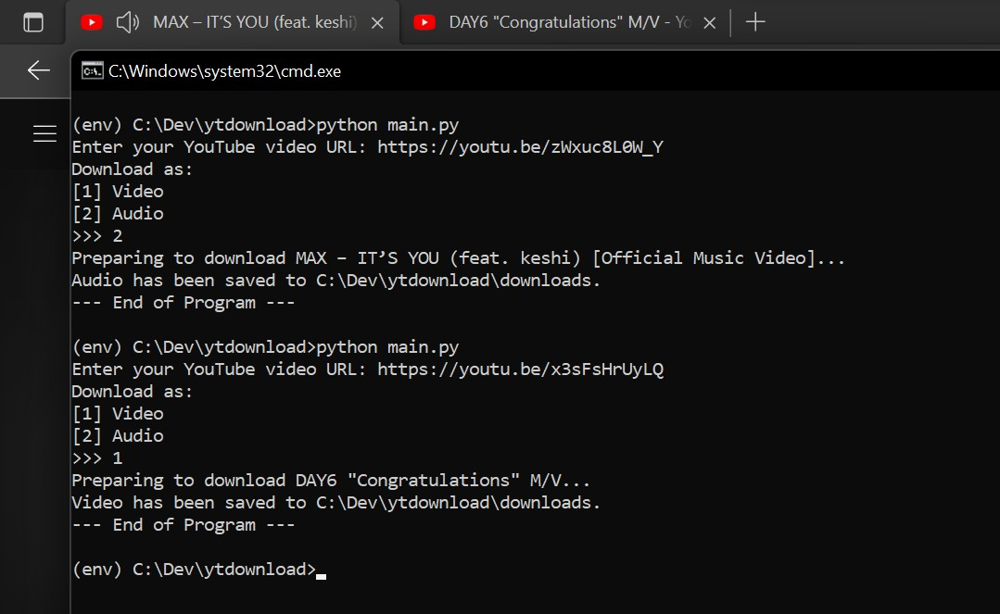

# YouTube Downloader

Download a youtube video or convert it into an audio (MP3) format. The video/audio will be downloaded to folder ```./downloads```. Notice that I have put two examples for the downloaded video and audio, also with the demo image below.

## How to Run

Here is the quickstart command (in CMD) to run this program on Windows. For MacOS, just modify it to a MacOS-friendly-and-compatible command, like ```~# source env\Scripts\activate```.

```
>>> python -m venv env
>>> env\Scripts\activate.bat
>>> pip install -r requirements.txt
>>> python main.py
```

Example:

